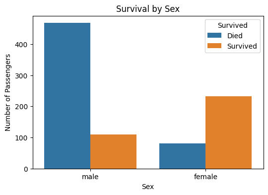
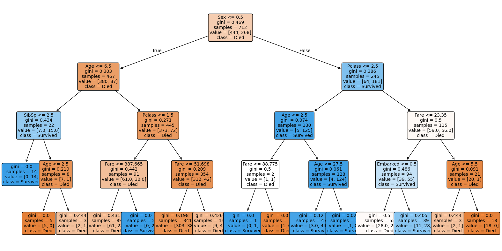
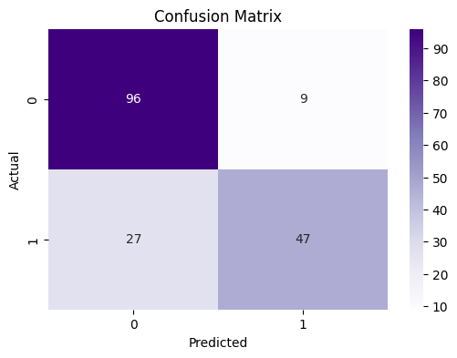

# Titanic Survival Prediction using Decision Tree

This is a small machine learning project where I worked with the Titanic dataset and built a Decision Tree model to predict whether a passenger survived or not.

I made this project in Google Colab. The main idea was not only to train a model, but also to understand which passenger features had the biggest impact on survival.

## Report

A full project report is also available in this repository:

[Open Report](Titanic_Report.pdf)

## What I did

In this project I went through the full basic machine learning workflow:

- loaded and explored the dataset
- checked missing values
- cleaned and prepared the data
- encoded categorical columns
- created several visualizations
- trained a Decision Tree classifier
- evaluated the model
- analyzed feature importance
- created decision tree visualizations

## Dataset

I used the Titanic dataset with 891 passenger records.

The target column is:

- `Survived`
  - `0` means the passenger did not survive
  - `1` means the passenger survived

The original dataset contains 12 columns, but not all of them were useful for the model.

## Features used for training

After preprocessing, I used these columns as model inputs:

- `Pclass` — passenger class
- `Sex` — gender
- `Age` — passenger age
- `SibSp` — number of siblings or spouses aboard
- `Parch` — number of parents or children aboard
- `Fare` — ticket fare
- `Embarked` — port of embarkation

## Data preprocessing

Before training the model, I cleaned the data:

- filled missing `Age` values with the median age
- filled missing `Embarked` values with the most frequent value
- removed `Cabin` because it had too many missing values
- removed `PassengerId`, `Name`, and `Ticket` because they were not useful for this basic model
- converted categorical values into numbers

Encoding used in the project:

```text
male = 0
female = 1

S = 0
C = 1
Q = 2
```

## Exploratory Data Analysis

I created several charts to better understand the dataset:

- survival distribution
- survival by gender
- survival by passenger class
- age distribution
- fare distribution

The most useful charts were survival by gender and survival by passenger class. They clearly showed that female passengers and higher-class passengers had better survival chances.

## Model

For this project I used a Decision Tree classifier:

```python
DecisionTreeClassifier(max_depth=4, random_state=42)
```

I chose Decision Tree because it is easy to understand and explain. It also works well for showing which features were important for the final prediction.

The data was split into:

- 80% training data
- 20% testing data

## Results

The model achieved the following results on the test set:

| Metric | Value |
|---|---:|
| Accuracy | 79.89% |
| Precision | 83.93% |
| Recall | 63.51% |
| F1-score | 72.31% |

The model correctly predicted 143 out of 179 test passengers.

## Confusion Matrix

| Actual / Predicted | Died | Survived |
|---|---:|---:|
| Died | 96 | 9 |
| Survived | 27 | 47 |

This means:

- 96 passengers were correctly predicted as not survived
- 47 passengers were correctly predicted as survived
- 9 passengers were predicted as survived but actually died
- 27 passengers were predicted as not survived but actually survived

## Feature Importance

The most important features were:

| Rank | Feature | Importance |
|---:|---|---:|
| 1 | Sex | 0.5796 |
| 2 | Pclass | 0.2005 |
| 3 | Fare | 0.0811 |
| 4 | Age | 0.0789 |
| 5 | SibSp | 0.0461 |
| 6 | Embarked | 0.0139 |
| 7 | Parch | 0.0000 |

The strongest predictor was `Sex`, followed by `Pclass`. This matches the general historical pattern that women and higher-class passengers had better survival chances.

## Visualizations

The notebook generates these files:

```text
survival_distribution.png
survival_by_sex.png
survival_by_class.png
age_distribution.png
fare_distribution.png
confusion_matrix.png
feature_importance.png
decision_tree.png
titanic_dtreeviz.png
titanic_cleaned.csv
model_results.txt
```

If I upload the images to the repository, I can also show them directly in this README.

Example:









## Main conclusions

From this project I found that:

- gender had the biggest impact on survival prediction
- passenger class was also very important
- female passengers had much higher survival chances
- third-class passengers had the highest number of deaths
- the Decision Tree model is useful because it gives both predictions and understandable decision rules

## Limitations

This is still a basic model, so it has some limitations:

- the `Cabin` column was removed because most values were missing
- the dataset does not include all real historical factors
- a single Decision Tree may miss more complex patterns
- the model missed some actual survivors

## Possible improvements

In the future, I could improve this project by:

- trying Random Forest
- trying Gradient Boosting
- tuning model parameters
- creating a `FamilySize` feature
- comparing several classification models
- improving the decision tree visualization for presentation

## How to run

This project was made in Google Colab.

Steps:

1. Open `Titanic.ipynb` in Google Colab.
2. Upload `train.csv`.
3. Run all cells.
4. The notebook will generate charts, cleaned data, model results, and visualizations.

If running locally, install the needed libraries:

```bash
pip install pandas matplotlib seaborn scikit-learn dtreeviz graphviz cairosvg
```

## Technologies used

- Python
- Google Colab
- Pandas
- Matplotlib
- Seaborn
- Scikit-learn
- dtreeviz
- Graphviz
- CairoSVG


## Author

Vladyslav Senkiv

